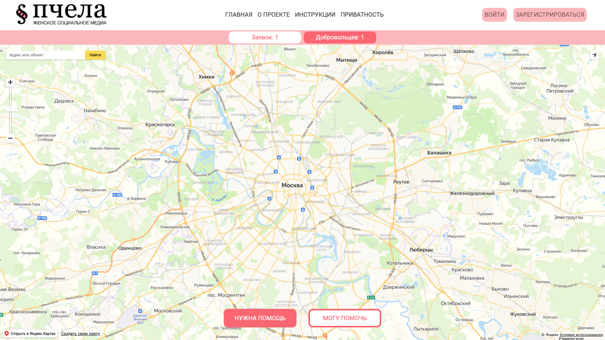

# WebMap
An interactive map of volunteers with the ability to register users through social networks, create their own mark on the map, create tasks and interact with the marks of other users (tasks). The administrative part allows user in administrator role to download the database (in xlsx format), delete files from the server, create and edit tasks, edit user roles, edit volunteer reports on completed tasks, etc.

For project normal work add:
1) Your smtp server name in PchelaMap/Areas/Identity/Data/EmailService.cs 19str
2) Your Facebook AppId and AppSecret in PchelaMap/Startup.cs 80,81 str
3) Your VKontakte ClientId and ClientSecret in PchelaMap/Startup.cs 86,87 str

Home page must look like this:

